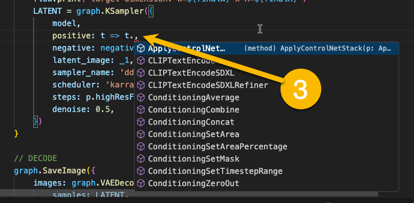

<div align="center">

# 🛋️ CushyStudio

## _The **easiest** and most **powerful** Stable Diffusion frontend_

   [](https://cla-assistant.io/rvion/CushyStudio)

[](https://discord.gg/GfAN6hF2ad)

</div>


- [1. CushyStudio **Actions**: self-contained mini Stable diffusion apps](#1-cushystudio-actions-self-contained-mini-stable-diffusion-apps)
  - [1.1. **Actions** are simple to use.](#11-actions-are-simple-to-use)
  - [1.2. **Actions** are pleasant to make](#12-actions-are-pleasant-to-make)
  - [1.3. **Actions** are easy to share](#13-actions-are-easy-to-share)
- [2. Quickstart Guide](#2-quickstart-guide)
  - [2.1. Installation](#21-installation)
  - [2.2. Starting](#22-starting)
  - [2.3. Updating](#23-updating)
  - [2.4. Core concepts](#24-core-concepts)
  - [2.5. Moving around](#25-moving-around)
  - [2.6. Use built-in cards](#26-use-built-in-cards)
  - [2.7. Install custom cards](#27-install-custom-cards)
  - [2.8. create custom cards](#28-create-custom-cards)
- [3. Features](#3-features)
  - [3.1. support `Local`, `Remote`, and `Cloud` ComfyUI instances](#31-support-local-remote-and-cloud-comfyui-instances)
  - [3.2. support multiple-ComfyUI support](#32-support-multiple-comfyui-support)
  - [3.3. ComfyUI compatible: Convert workflow to Action.](#33-comfyui-compatible-convert-workflow-to-action)
  - [3.4. Real-time enabled](#34-real-time-enabled)
  - [3.5. CivitAI integration](#35-civitai-integration)
  - [3.6. Built-in full-featured Image Editor](#36-built-in-full-featured-image-editor)
  - [3.7. Easy to extend](#37-easy-to-extend)
  - [3.8. Create your own Cards to streamline any image or video production](#38-create-your-own-cards-to-streamline-any-image-or-video-production)
- [4. Quickstart Guide For Action Creators](#4-quickstart-guide-for-action-creators)
  - [4.1. How does `CushySudio` Work](#41-how-does-cushysudio-work)
  - [4.2. What is an `Action` ?](#42-what-is-an-action-)
  - [4.3. What is an `Action` ?](#43-what-is-an-action-)
  - [4.4. Create your first deck](#44-create-your-first-deck)
  - [4.5. `Prefabs` so you don't repeat yourself](#45-prefabs-so-you-dont-repeat-yourself)
    - [4.5.1. prefabs are just functions.](#451-prefabs-are-just-functions)
    - [4.5.2. Naming Conventions](#452-naming-conventions)
    - [4.5.3. Use a UI Prefab](#453-use-a-ui-prefab)
    - [4.5.4. Execution Prefab](#454-execution-prefab)
  - [4.6. Various Function notations](#46-various-function-notations)
    - [4.6.1. the special `() => ({ })` notation to return objects in a single line](#461-the-special-----notation-to-return-objects-in-a-single-line)
  - [4.7. Publish your Deck](#47-publish-your-deck)
- [5. Frequently Asked Questions:](#5-frequently-asked-questions)
  - [5.1. Q: Will **CushyStudio** remain open source and free?](#51-q-will-cushystudio-remain-open-source-and-free)
  - [5.2. Q: Why the AGPL and not the GPLV3?](#52-q-why-the-agpl-and-not-the-gplv3)
  - [5.3. Q: Any plans for a paid version of **CushyStudio**?](#53-q-any-plans-for-a-paid-version-of-cushystudio)
- [6. Theming](#6-theming)

# 1. CushyStudio **Actions**: self-contained mini Stable diffusion apps

-   CushyStudio **Actions** are interactive generative "apps" with dedicated UIs.
-   They make it super easy and fun to explore all generative art has to offer.
-   CushyStudio allows you to run, create, and share **Actions**


</img> </img>

<!-- <div src='docs/static/img/screenshots/2023-10-18-22-13-26.png' style='width:49%'>
test</div>  -->

<!-- ---------------------------------------------- -->

## 1.1. **Actions** are simple to use.

-   ✅ Non-technical **_Card_** interfaces

    -   Per use-case UI
    -   Simple widgets

-   🚂 Fast previews, real-time feedback

    -   Interactive at its core
    -   Real-time **Actions** with continuous generations

-   🖌️ Built-in commodities

    -   `Image` and `Mask` editors
    -   Modular Layout to stay organized and focuses

<!-- </img> -->


## 1.2. **Actions** are pleasant to make

-   🚀 CushyStudio comes with amakes it easy to build cards

    -   Pre-configured ecosystem: NO SETUP NEEDED
    -   Built-in **_ComfyUI_** to **_Action_** converter
    -   Graphical Action builder `(soon™️)`
    -   A full **_TypeScript Action SDK_** + Compiler to go further

-   🧑‍💻 Powerful fully-type-safe typescript SDK
    -   A built-in standard library made to quickly build your dream workflow
    -   Use lambda to get completion only for the node that produces the value needed
    -   Every single value/enum is typed

-   🧠 **_ComfyUI_** engine At its core

    -   All custom nodes are supported
    -   Custom interface to explore and play with nodes
    -   Deep integration with **_ComfyUI Graph_**
    -   A well-thought interface to explore and play with nodes

-   💪 From 0 to 100 in no time

    -   Modularize, reuse, and grow your toolset
    -   Share your deck/cards with the world


## 1.3. **Actions** are easy to share

-  📦 one-click create your custom `Deck`

    -   one-click open a fully pre-configured `vscode` workspace ready to go
    -   No setup needed: injected globals so you can focus on your card logic
    -   No dependencies


<!--  -->


# 2. Quickstart Guide

## 2.1. Installation

During `Beta`, **CushyStudio** install is done manually with git.

Ensure you have the following installed:

-   [NodeJS](https://nodejs.org/en/download) (18 or higher)
-   [ComfyUI](https://github.com/comfyanonymous/ComfyUI)
-   [Git](https://git-scm.com/book/en/v2/Getting-Started-Installing-Git)

Then, to install **CushyStudio**, run these commands in a terminal:

```sh
git clone https://github.com/rvion/CushyStudio
cd CushyStudio
npm install
```

## 2.2. Starting

You can start **CushyStudio** in two ways:

- by running `npm start` in a terminal, at the root of you CushyStudio install
- by running the `2_run.sh` (mac, linux) or `2_run.bat` (window)


## 2.3. Updating

you can update **CushyStudio** in 3 ways:

- 1. Using the update button in the top navbar
- 2. By running the `1_update.sh` (mac, linux) or `1_update.sh` (window)
- 3. By running in a terminal:
  ```
  git pull
  npm install
  ```

⚠️ some update will require you to close **CushyStudio** first, for `npm install` to work properly.
If in-app (1) update fails, try to close Cushy and run other update methods (2, 3)

<!-- ## 2.4. See it in action -->

## 2.4. Core concepts

- `Library`


## 2.5. Moving around

- **CushyStudio** use a powerful **dock** system to organize your workspace.
- every panel can be moved around, and even detached from the main window.

the top bar

## 2.6. Use built-in cards

- Use the `Library` panel to select the `CushyStudio/prompt` card.
- pick a model and click `run` to see it in action

## 2.7. Install custom cards

- Open the `Library` panel to select the `CushyStudio/prompt` card.


## 2.8. create custom cards

# 3. Features

## 3.1. support `Local`, `Remote`, and `Cloud` ComfyUI instances

-   Automatically download images in your local outputs folder
-   Automatically upload missing files
-   powerfull image hashing system to avoid duplicate uploads

## 3.2. support multiple-ComfyUI support

-   ✅ Quickly switch between various ComfyUI setups
-   ✅ Parallelize work across multiple instances

Edit the list of ComfyUI setups in `CONFIG.json` or click the `HOSTS` button in the top bar to configure your instances.


https://github.com/rvion/CushyStudio/assets/2150990/2121db07-c246-4523-ac0e-294572450b32

## 3.3. ComfyUI compatible: Convert workflow to Action.

**_🛋️ CushyStudio_** is directly compatible with **_ComfyUI_** workflow json format and images. Add them to the action folder to quickly use them inside CushyStudio.

## 3.4. Real-time enabled

https://github.com/rvion/CushyStudio/assets/2150990/d71d7f9a-b0e9-415d-ab5a-7852b17894dc

## 3.5. CivitAI integration


-   ✅ Embedded Civitai browser
-   ✅ Civitai custom ComfyUI Nodes support
-   ✅ Dedicated Civitai input widgets to augment your allow your cards to select CivitAI models directly

## 3.6. Built-in full-featured Image Editor

Layers, effects, masks, blending modes, ...and more. Always one click away


## 3.7. Easy to extend

👉 In case you have a problem, check the logs and report what you see

<details>
  <summary> Click here to see how to reveal the debug console</summary>


</details>

## 3.8. Create your own Cards to streamline any image or video production


<p align="center">
  
&nbsp; &nbsp; &nbsp; &nbsp;
  
</p>

1. Define your own UI
2. Build one or many prompts with custom logic in TypeScript
3. Type-safe experience pushed to the MAXIMUM
    1. Every single value/enum is typed
    2. A built-in standard library made to quickly build your dream workflow
    3. Use lambda to get completion only for the node that produces the value needed

# 4. Quickstart Guide For Action Creators

Creating **Actions** is easy.
In this section, we will

- understand how **CushyStudio** works,
- see how to create a custom deck
- see how to edit your cards
- see how to publish your deck on the library

## 4.1. How does `CushySudio` Work

1. On startup, **_CushyStudio_** connect to your **_ComfyUI_** server(s)

2. **CushyStudio** then scan you `ComfyUI` install and generates whole **_TypeScript SDK_** supporting all your custom nodes, assets, models instaleld, etc.

3. All your custom nodes, models, and images will be converted to `enums`, `classes`, `helpers`, etc, allowing you to create **Actions** with maximum type safety and completion. you can check the generated SDK at `schema/global.d.ts`.
    - 👉 this file is updated after each ComfyUI connection.
    - 👉 It means it will only be created after the first successful connection to your ComfyUI instance


## 4.2. What is an `Action` ?

An `Action` is a self  containing
- a widget definition ( `"ui"` function)
- an execution logic  ( `"run"` function)
  - the `"run"` function will receive the widget value when you click the `run` button


Here is a very simple card that print the value you enter


```ts
card({
    ui: (form) => ({ name: form.str({}) }),
    run: (runtime) => runtime.print('Hello World')
})
```


## 4.3. What is an `Action` ?

A `Deck` is a folder containing

  - a list of **Actions**
  - a list of `assets`
  - a list of `prefabs`
  - some `documentation` about how to use those cards
  - some `metadata` for proper library indexing.

Decks are made to be shared.

- You can download `Decks` from the `Library` panel
- You can publish `Decks` from the `Library` panel


##  4.4. Create your first deck

1. click the `[+ Create Deck]` button at the top of the `Library`

2. enter your `github username` and `deck name`
   1. 👉 your `github username` will be your dedicated namespace in the library
   2. 👉 all your decks will live under the `library/<username>/` folder

    

3. click `[OK]`

   1. it will create those files
      1.  `library/<username>/<deckname>/readme.md`
          - a readme file to explain what your deck is about
      2.  `library/<username>/<deckname>/cushy-deck.json`
          -  manifest that list all your cards for better library integration
      3.  `library/<username>/<deckname>/_prefab.ts`
          - a file where you can place your prefabs.
          - it contains some example prefabs for you to build uppon
          - file starts with an `_` so it's not listed in CushyStudio
      4.  `library/<username>/<deckname>/sample-card-1.ts`
          - first sample action
      5.  `library/<username>/<deckname>/sample-action-2.ts`
          - second sample action

    2.  it will also initialize a git
        1.  it will run `git init` in the created repository
        2.  it will run `git remote add origin "https://github.com/<username>/<deckname>`)
        3.  it will run `git remote add github "git@github.com:<username>/<deckname>.git`)
        - 👉 this is to make it easy to publish your deck to GitHub
        - 👉 you can also use any other git host, or none at all


4. Open the `sample-action-1.ts` card

 5. click the `[edit]` button to open the card in `vscode`
    - 👉 everything is preconfigure to run correctly in vscode and make you productive right away
    - 👉 fo this, you need to open the whole CushyStudio folder within vscode
    - 👉 (NOT just the action folder, NOR the action file itself)


```ts
card('demo1-basic', {
    author: 'rvion',
    ui: (form) => ({ positive: form.str({ label: 'Positive', default: 'flower' }), }),
    run: async (action, form) => {
        //  build a ComfyUI graph
        const graph = action.nodes
        const ckpt = graph.CheckpointLoaderSimple({ ckpt_name: 'albedobaseXL_v02.safetensors' })
        const seed = action.randomSeed()
        const sampler = graph.KSampler({
            seed: seed,
            steps: 20,
            cfg: 14,
            sampler_name: 'euler',
            scheduler: 'normal',
            denoise: 0.8,
            model: ckpt,
            positive: graph.CLIPTextEncode({ text: form.positive, clip: ckpt }),
            negative: graph.CLIPTextEncode({ text: '', clip: ckpt }),
            latent_image: graph.EmptyLatentImage({ width: 512, height: 512, batch_size: 1 }),
        })

        graph.SaveImage({
            images: graph.VAEDecode({ samples: sampler, vae: ckpt }),
            filename_prefix: 'ComfyUI',
        })

        // run the graph you built
        await action.PROMPT()
    },
})
```

<!-- 1. See how actions look like by dropping any **_ComfyUI_** `workflow` or `image` into the action and looking at the `converted.ts` -->

An `Card` is a file containing

-   An UI definition (widgets, form, styles, default values, tabs, etc...)
-   A piece of code that runs your action
-   ...And more


## 4.5. `Prefabs` so you don't repeat yourself

The simplest way to modularize your **Actions** is to build `prefabs`.

- `Prefabs` allow you to re-use parts of your cards in other cards.
- `Prefabs` allow you to re-use parts of your cards multiple times in your card
- `Prefabs` are functions that can add `widgets` (ui part) or `subgraphs` (execution part).
- `Prefabs` allow you to build complex cards very efficiently.

_Best practices:_

- Usually, your `Deck` will contain one or many `prefab` files,
- you can The main `prefab` used by the built-in `deck` here: `library/CushyStudio/default/_prefab.ts`:


### 4.5.1. prefabs are just functions.

- 👉 a `ui prefab` is a `function` that takes a `formBuilder` and returns a `Widget`.
- 👉 a `run prefab` is a function that takes a `runtime` and modify it's `graph` or perform other actions.
- 👉 a `util prefab` is an helper function that do whatever.

example:

```ts
// FILE: `_ui.ts`
import type { FormBuilder } from 'src/controls/FormBuilder'

// 📝 this is a ui prefab you can use in any card you want.
export const ui_startImage = (form: FormBuilder) =>
    form.group({
        items: () => ({
            startImage: form.imageOpt({ group: 'latent' }),
            width: form.int({ default: 512, group: 'latent', step: 128, min: 128, max: 4096 }),
            height: form.int({ default: 512, group: 'latent', step: 128, min: 128, max: 4096 }),
            batchSize: form.int({ default: 1, group: 'latent', min: 1, max: 20 }),
        }),
    })
```

### 4.5.2. Naming Conventions


### 4.5.3. Use a UI Prefab

To use a `prefab` in your card, you can simply import it and use it.


- `ui  prefabs` are made to be used in the `ui` function of your card.
- `run prefabs` are made to be used in the `run` function of your card.
- `run prefabs` are made to be used in the `run` function of your card.


```ts
// FILE: `card1.ts`
import { ui_startImage } from './_ui'

card({
    name: 'card1',
    ui: (formBuilder) => {
        return {
            a: ui_startImage(formBuilder), // 👈 HERE
            b: ui_startImage(formBuilder), // 👈 HERE
            c: formBuilder.int({ default: 1 }),
        }
    },
    run: async (flow, p) => {
        flow.print(`startImage: ${p.a.startImage}`)
        flow.print(`startImage: ${p.b.startImage}`)
    },
})
```
### 4.5.4. Execution Prefab

The resulting card looks like this:


## 4.6. Various Function notations


**CushyStudio** aims to be accessible to non-programmers, while still being powerful enough for advanced users. You don't need to know typescript to get started, you can just learn what you need along the way.

This section is not a typescript tutorial, but rather a list of points of attention you may need to pay attention when building cards if you're not a typescript develloper.

Be careful to understand those various notations for functions


### 4.6.1. the special `() => ({ })` notation to return objects in a single line


```ts
const fn = () => ({ a: 1 })
//               👆      👆

```

This is equivalent to:

```ts
const fn = () => {
    return {a: 1}
}
```

or to

```ts
function fn() {
    return {a: 1}
}
```

## 4.7. Publish your Deck

Publishing your deck/cards is easy!

1. When creating a deck, **CushyStudio** automatically
   1. initialize the git repository for you.
   2. configure remote to point to the GitHub repository with the same name as your deck
      1.

2.  Create a GitHub repository. (https://github.com/new)

    

3.  Commit your deck files
    1.  you can one-click the `publish` button in your deck entry in the library
    2.  or youyou can follow instructions given by Git Hub on the new repository page

4.  Open an issue asking to add your `Deck` to the `Library`.

    -   https://github.com/rvion/CushyStudio/issues/new/choose

<details>
<summary>SHOW EXAMPLE</summary>

```sh
cd library/rvion

git init
Initialized empty Git repository in /Users/loco/dev/CushyStudio/library/rvion/.git/

git add .

git commit -m "first commit"
[master (root-commit) 602fab1] first commit
 4 files changed, 146 insertions(+)
 create mode 100644 mask-face.ts
 create mode 100644 rembg.ts
 create mode 100644 replace-part.ts
 create mode 100644 test.ts

git remote add origin git@github.com:rvion/cushy-example-deck.git
```

Then open an issue asking [there](https://github.com/rvion/CushyStudio/issues/new/choose)

</details>


# 5. Frequently Asked Questions:

In case you want to know more about the CLA, here are some answers to questions you might have:
If your questions are not covered, you can take a look at the full FAQ: https://github.com/rvion/CushyStudio/blob/master/docs/FAQ.md

## 5.1. Q: Will **CushyStudio** remain open source and free?

**A**: Absolutely! I'm committed to keeping **CushyStudio** 100% open source and free to use as a tool. Create assets, art, games – you name it. It's your creation, and I'm just here to help you make it.

## 5.2. Q: Why the AGPL and not the GPLV3?

**A**: For now, **CushyStudio** is licensed under AGPL as I aim to guide the project towards sustainability. I plan to transition to GPLV3 in the future, once the project achieves a stable foundation. This choice is designed to safeguard the project and its dedicated community. Rest assured, utilizing **CushyStudio** for asset creation remains unrestricted. My primary intention is to prevent the unauthorized resale or commercialization of **CushyStudio** as a service.

## 5.3. Q: Any plans for a paid version of **CushyStudio**?

**A**: No, and that's a promise. **CushyStudio** will always be free and open source. While I do have plans to offer complementary services (like cloud GPU services), the core of **CushyStudio** will remain free for all. Again, I simply wish to prevent unauthorized resale or commercialization of **CushyStudio** as a service.

Thank you for your understanding and patience in going through this agreement. Together, let's make **CushyStudio** better for everyone! 💪🎉


# 6. Theming