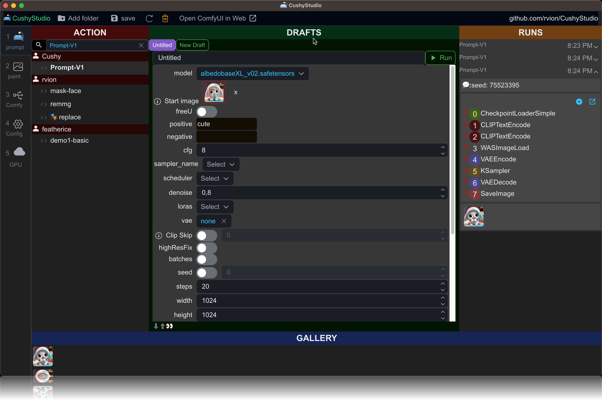

<div align="center">

# 🛋 CushyStudio

(ALPHA version)

## The most easy and powerful Stable Diffusion frontend

[](https://discord.gg/GfAN6hF2ad)

</div>


# Installation

```sh
git clone https://github.com/rvion/CushyStudio
cd CushyStudio
npm install
npm start
```

# Features

---

quickly switch between various ComfyUI setups (local machine, remote machine, cloud vendors, etc...)

|                                                                          |                                                                                          |
| ------------------------------------------------------------------------ | ---------------------------------------------------------------------------------------- |
| in `CONFIG.json`                                                         |                                                                                          |
|                  | https://github.com/rvion/CushyStudio/assets/2150990/cf3027e2-28cb-41e5-a21a-589d5b6b54bd |
| ------------------------------------------------------------------------ | ---------------------------------------------------------------------------------------- |

<!-- 

https://github.com/rvion/CushyStudio/assets/2150990/cf3027e2-28cb-41e5-a21a-589d5b6b54bd

-->

## 1. Turn any ComfyUI workflow into a powerful Action with dedicated UI custom execution logic



You can import your workflow by dropping it into the `./actions` folder

`CushyStudio` can import

-   workflows in `*.png` file
-   workflows in `*.workflows.json` (exported via save button in ComfyUI)
-   workflows in `*.workflows-api.json` (exported via save (API Format) button in ComfyUI)

👉 be sure to rename the file so it ends like this one of the options in the list above

<details>
  <summary>click here to see how to enable the api format</summary>


</details>

👉 In case you have a problem, can you check the logs and report what you see ?

<details>
  <summary>click here to see how to reveal the debug console</summary>


</details>

## 2. Edit and Inpaint like a pro


1. layers
2. efects
3. masks
4. blending modes
5. ...and more

## 3. create your own Actions to streamline any image or video production


<p align="center">
  
&nbsp; &nbsp; &nbsp; &nbsp;
  
</p>

1. define your own UI
2. build one or many prompts with custom logic in typescript
3. type-safe experience pushed to the MAXIMUM
    1. every single value / enum is typed
    2. a built-in standard library made to quickly build your dream workflow
    3. use lambda to get completion only for the node that produce value needed

<!-- global config file to change path to ComfyUI:

```
./workspace/CONFIG.json
``` -->

<!--

---

# Features

- Custom nodes
- maximum type safety when writing scripts
-->
