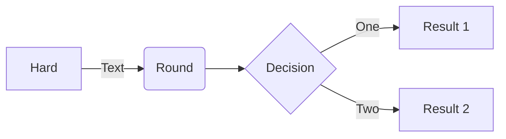

```sh
venv
cd ComfyUI/custom_nodes
git clone https://github.com/Fannovel16/comfy_controlnet_preprocessors
cd comfy_controlnet_preprocessors
python install.py
# seems to overwrite my pytorch setup 😅
```

---

-   better various import flows
-   finish paint
-   add pick best interraction
-   investigate embeddings
-   proper basic flow

-   new section about request for comfyUI

-   get list of embeddings via object_info
-   send warnings

---

ping m1kep with graph view



-   todo: make mermaid lazy loaded, only init on first markdown or html file sent

cd ComfyUI
cd custom_nodes
git clone https://github.com/Fannovel16/comfy_controlnet_preprocessors
git clone https://github.com/BlenderNeko/ComfyUI_Cutoff
git clone https://github.com/Davemane42/ComfyUI_Dave_CustomNode
git clone https://github.com/hnmr293/ComfyUI-nodes-hnmr
git clone https://github.com/guoyk93/yk-node-suite-comfyui
mkdir JustNetralExtras
cp /Users/loco/Desktop/clipseg.py JustNetralExtras/clipseg.py
cp /Users/loco/Desktop/DeglazeImage.py JustNetralExtras/DeglazeImage.py

---

from wyrdewyn:

> awww, I can't afford spine

> I think the only free one left is dragonbones. Not sure though, haven't looked in the 2d deformation stuff lately.

> I was last looking at inochi2d https://github.com/Inochi2D/inochi2d

> https://lunafoxgirlvt.itch.io/inochi-creator

---

wishlist

-   api to retrieve list of available embedding / or a way to include them in the comfy schemas
-   a way to send errors to the front via websocket so the front can properly show what's going wrong
-   a new prompt ID value in all WS payloads scoped to a prompt
-   some progress in @data it auto-installer, so I can just use this api to ensure all the demo workflows (a.k.a scripts, a.k.a. mini SD apps) in the demo library i'm building are self-contained and install missing deps on their own
