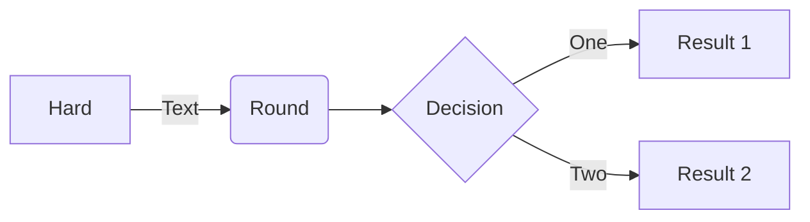

```sh
venv
cd ComfyUI/custom_nodes
git clone https://github.com/Fannovel16/comfy_controlnet_preprocessors
cd comfy_controlnet_preprocessors
python install.py
# seems to overwrite my pytorch setup 😅
```

---

-   better various import flows
-   finish paint
-   add pick best interraction
-   investigate embeddings
-   proper basic flow

-   new section about request for comfyUI

-   get list of embeddings via object_info
-   send warnings

---

ping m1kep with graph view



-   todo: make mermaid lazy loaded, only init on first markdown or html file sent
