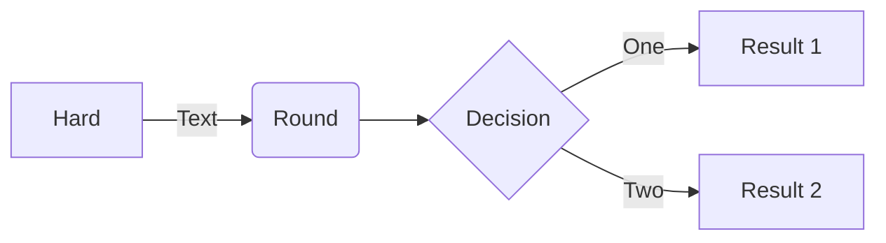

-   flow: namespace (contains the rest)
-   single var send to flow
-   flow contains primitive dictionary + node dictionary + various output, list of prev prompts, etc
-   every action run in a flow
-   you can run an action in an empty flow
-   drag and dropping an image in the flow will create a new flow with a single image node
-   drag and dropping from a folder auto-add the tag
-   flow can prompt, or not. prompting is explicit

---

```sh
venv
cd ComfyUI/custom_nodes
git clone https://github.com/Fannovel16/comfy_controlnet_preprocessors
cd comfy_controlnet_preprocessors
python install.py
# seems to overwrite my pytorch setup 😅
```

---

-   better various import flows
-   finish paint
-   add pick best interraction
-   investigate embeddings
-   proper basic flow

-   new section about request for comfyUI

-   get list of embeddings via object_info
-   send warnings

---

ping m1kep with graph view



-   todo: make mermaid lazy loaded, only init on first markdown or html file sent

cd ComfyUI
cd custom_nodes
git clone https://github.com/Fannovel16/comfy_controlnet_preprocessors
git clone https://github.com/BlenderNeko/ComfyUI_Cutoff
git clone https://github.com/Davemane42/ComfyUI_Dave_CustomNode
git clone https://github.com/hnmr293/ComfyUI-nodes-hnmr
git clone https://github.com/guoyk93/yk-node-suite-comfyui
mkdir JustNetralExtras
cp /Users/loco/Desktop/clipseg.py JustNetralExtras/clipseg.py
cp /Users/loco/Desktop/DeglazeImage.py JustNetralExtras/DeglazeImage.py

---

from wyrdewyn:

> awww, I can't afford spine

> I think the only free one left is dragonbones. Not sure though, haven't looked in the 2d deformation stuff lately.

> I was last looking at inochi2d https://github.com/Inochi2D/inochi2d

> https://lunafoxgirlvt.itch.io/inochi-creator

---

wishlist

-   api to retrieve list of available embedding / or a way to include them in the comfy schemas
-   a way to send errors to the front via websocket so the front can properly show what's going wrong
-   a new prompt ID value in all WS payloads scoped to a prompt
-   some progress in @data it auto-installer, so I can just use this api to ensure all the demo workflows (a.k.a scripts, a.k.a. mini SD apps) in the demo library i'm building are self-contained and install missing deps on their own

---

list of embeddings: http://127.0.0.1:8188/embeddings

---

```
@server.PromptServer.instance.routes.get("/customnode/getlist")
@server.PromptServer.instance.routes.get("/alternatives/getlist")
@server.PromptServer.instance.routes.get("/externalmodel/getlist")
@server.PromptServer.instance.routes.post("/customnode/install")
@server.PromptServer.instance.routes.post("/customnode/uninstall")
@server.PromptServer.instance.routes.post("/customnode/update")
@server.PromptServer.instance.routes.post("/model/install")
```

from data lt

---

ann

```
🛋️ Regarding Cushy, the pieces are finally falling in place together, so this is quite an exiting moment.
I've had a fair bit of doubts lately, when seeing that Cushy was not as practical as I was hoping, but those doubts are gone with the new "action" paradigm; I'm now quite convinced Cushy will become one of the main ways to play with Stable Diffusion and other generative art stutff. 🔥

Public thanks to @someanon, who (more than) helped with this !

Basically, I found a good abstraction to package a set of graph modification into quick action buttons.
It support finding values and node available in current context, creating missing ones, or removing some, updating links, adding "tags", setting dictionary variables, etc.

So code is now just a way to create your own actions so you can play in the UI.
Cushy will become a real tool, without the need to code except for advanced users.
Cushy will ship with a default set of actions, allowing you to go from start to finish

As Cushy is becoming more of a tool to go from start to finish, a local database has been added so refreshing the page preserve all your assets/ actions / history. You now have a growing list of assets, that fork and evolve with each actions you take, and you can always start from any point in the history to try more things..

I'm also trying to come up with a nice way for custom_node creator and users to share their actions.
Thanks again to all who helped test the current (bad / impractical) version 😄
```

---

```sh

./node_modules/.bin/esbuild src/back/main.ts --bundle --outfile=dist/main2.js --platform=node --sourcemap --watch --loader:.node=file --external:fsev

node --watch dist/main2.js
```
