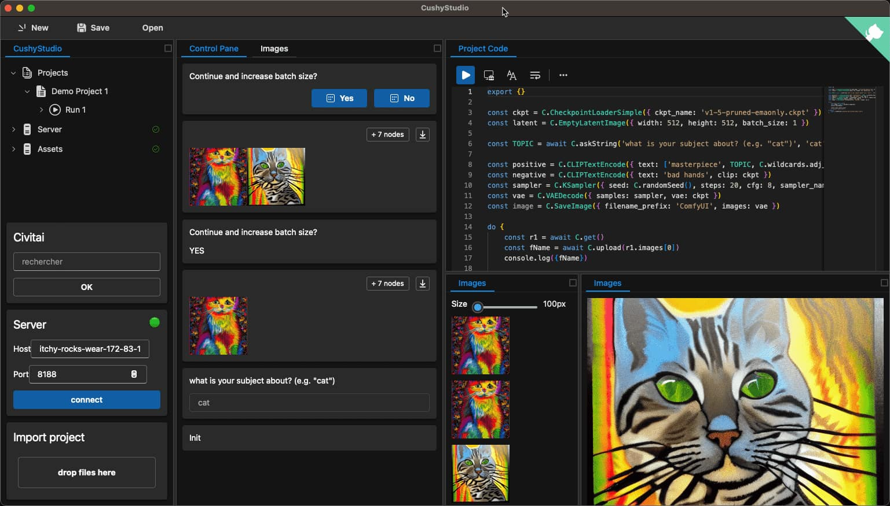
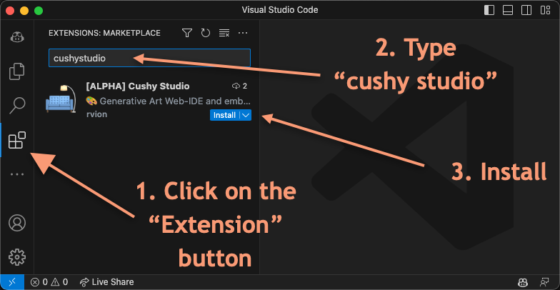

<div align="center">

# 🛋 CushyStudio - _Generative Art studio_

`CushyStudio` is an AI-powered Generative-Art studio for creatives and developpers,
enabling new ways to produce art, assets, or animations.
It offers scripting tools and dynamic interfaces for live human-feedback, curation
and guidance along generation processes. It is cross-platform and open-source.

👉 requires a [ComfyUI](https://github.com/comfyanonymous/ComfyUI) setup available.


[](https://discord.gg/GfAN6hF2ad)

|
[Features](#features) |
[Getting started](#getting-started) |
[Installation](#installation) |
[Configuration](#configuration) |
[Integrations](#third-party-integrations) |
[Developpment](#developpment) |
[Contributing](#contributing) |
[Architecture](#architecture) |

</div>

---

<div align="center">

<video src='./public/2023-04-16_15-48-30.mp4'></video>

[](./public/2023-04-16_15-48-30.mp4)

</div>

<!--   -->

<!--  -->
<!--  -->

---

## 🗂️ Installation

1. install [ComfyUI](https://github.com/comfyanonymous/ComfyUI)
    - [Download Models](scripts/download-models.sh) (🔶 temporary, until CushyStudio can download them for you)
    - start Comfy `python main.py --listen 0.0.0.0`
2. install [vscode](https://code.visualstudio.com/)
3. install `CushyStudio` in the extension menu

    - [(maretplace link)](https://marketplace.visualstudio.com/items?itemName=rvion.cushystudio)

    

4. configure your server properly in your vscode settings (`.vscode/settings.json`)

    ```jsonc
    {
        "cushystudio.serverHostHTTP": "http://192.168.1.20:8188", // include the protocol, no trailing slash /
        "cushystudio.serverWSEndoint": "ws://192.168.1.20:8188/ws" // ws endpoint path mandatory (here: /ws)
    }
    ```

    (🔶 you may need to restart vscode for now, until I make the config dynamic)

---

## 🎉 Getting Started

1. ensure you have `ComfyUI` running and accessible from your machine and the `CushyStudio` extension installed.
1. start vscode and open a folder or a workspace ( 👉you need a folder open for cushy to work)
1. create a new file ending with `.cushy.ts` (e.g. `demo-1.cushy.ts`)
1. you should see CushyStudio activating

    - it will create a `.cushy` folder at the root of your workspace, that will contain typescript definitions

        

1. CushyStudio extension should start automatically
    - it will create a `.cushy` folder at the root of your workspace
1. ensure ComyUI server is connectly connected (check the "Cushy" **status bar** at the bottom)

```ts
/// <reference path=".cushy/cushy.d.ts" />
// add the comment above with the triple slash (`///`) to enable autocompletion
// it should points to the file generated by CushyStudio uppon startup

// prettier-ignore
WORKFLOW('demo-1', async (graph, flow) => {
    //                                                      V replace this string with one you have
    const ckpt = graph.CheckpointLoaderSimple({ ckpt_name: 'deliberate_v2.safetensors' })
    const latent = graph.EmptyLatentImage({ width: 512, height: 512, batch_size: 1 })
    const positive = graph.CLIPTextEncode({ text: 'masterpiece, (chair:1.3)', clip: ckpt })
    const negative = graph.CLIPTextEncode({ text: '', clip: ckpt })
    const sampler = graph.KSampler({ seed: flow.randomSeed(), steps: 20, cfg: 10, sampler_name: 'euler', scheduler: 'normal', denoise: 0.8, model: ckpt, positive, negative, latent_image: latent, })
    const vae = graph.VAEDecode({ samples: sampler, vae: ckpt })
    graph.SaveImage({ filename_prefix: 'ComfyUI', images: vae })
    await flow.PROMPT()
})
```

then move your cursor anywhere in the prompt and use the

| command                  | Keybinding  |     |
| ------------------------ | ----------- | --- |
| Test: Run Test at cursor | `cmd+;` `c` |     |

---

## 🐰 Relation With ComfyUI

`ComfyUI` is a powerful and modular stable diffusion backend (and graph GUI).
`ComfyUI` supports
`CushyStudio` will connect to your ComfyUI server, and fetch the schema of all available nodes and available

---

## 🤝 Contributing

1. install [vscode](https://code.visualstudio.com/)
2. install [node](https://nodejs.org/en)
3. clone the repo and install dependencies
    ```sh
    git clone https://github.com/rvion/CushyStudio.git
    cd CushyStudio
    npm install
    ```
4. watch/build the extension front and back
    ```sh
    npm run back:dev   # build and watch the extension node part
    npm run front:dev  # build and watch the extension webview part
    ```
5. open a new vscode in `extension development` mode

    - either with `F5` (recommanded)
    - or with `npm run vscode:dev`

6. [recommanded] then add a shortcut to trigger a reload quickly

<details>
<summary>
pointers: add a new interraction
</summary>
-   in `src/core-types/MessageFromExtensionToWebview.ts`:

    -   see `type MessageFromExtensionToWebview`
    -   see `type MessageFromWebviewToExtension`

-   in `src/core-back/FrontWebview.ts`,

    -   see `onMessageFromWebview` function

-   in `src/core-front/FrontState.ts`

    -   see `onMessageFromExtension` function

-   in `src/ui/WebviewUI.tsx`, to add custom ui for your step
</details>

---

## ✅ Early Features-Set / Roadmap

_Project is still early, but here is an overview of the plan_

<!-- [🟢 = acceptable, 🔶 = partial, ☣️ = not ready] -->

-   ✅ **workspace and project management**
-   [ ] **manage ComfyUI installation**
    -   [ ] download and install custom nodes
    -   [ ] download and install various models
-   [◐] **Import** existing projects
    -   ✅ import from `ComfyUI images`
    -   [◐] import from `ComfyUI json`
    -   [◐] import from `Automatic1111`
    -   [ ] package assets with projects
-   [◐] **Installer**
    -   ✅ small footprint
    -   [◐] self-updating binary for simple
-   [◐] integrated `OpenPose` library to `puppet`, `animate`, `interpolate` frames of stickmans
    -   [◐] generate bone images from openpose definitions
-   [ ] image building API
    -   [ ] paint with words
    -   [ ] prefab library
-   [◐] Interractive Evaluation
    -   ✅ `askString` question
    -   ✅ `askBoolean` question
    -   [◐] `choose best picture` question
    -   [◐] `choose next branch` question
    -   [ ] .... a lot more to be done
-   [◐] Deep ComfyUI Integration
    -   ✅ Custom nodes support
-   [◐] Civitai Integration
    -   [◐] search
-   [◐] Parrallel Execution
    -   [◐] multiple Comfy Server support
    -   [◐] multiple Comfy Server support
-   ✅ Work with cloud GPU offers
    -   ✅ yes, examples soon.
-   [◐] QOL
    -   [◐] more shortcuts
    -   [ ] [open in explorer](https://github.com/tauri-apps/tauri/issues/4062#issuecomment-1338048169)
-   MISC
    -   [ ] better onboarding UI to help people have a working setup
    -   [ ] properly fix/finish workspace.openScript
    -   [ ] finish loading projects
    -   [ ] save projects on disk / via metadata
    -   [ ] improve comfy import
    -   [ ] add folder of examples

---

## 🚧 Architecture

-   `CushyStudio` is a packaged as a **VSCode extension**.

-   It's unusual, but it makes perfect sense. Before being a vscode extension, it used to be
    -   a standalone webpage made to be embbeed
    -   then a regular web app with a deno server
    -   then an electron app
    -   then a tauri app
    -   then a vscode extension

VScode simply turned out to be best host I found for a script-based generative-art studio.

-   A: because vscode can be seen as a standalone `web browser distribution` + `nodejs distribution` + `script editor UI` + `typescript distribution` + `productivity toolset`
    -   the `vscode` extension spwan `nodejs` processes and open `webviews`.
    -   it has with config saving, it has a great keybinding system, with great set of default shortcuts.
    -   plugin ditribution is easy, no need to bother with complex binary signing processes, or app-store validation processes.
    -   A large part of my audience (myself included) already has vscode setup.
    -   it offers a principled way to create productivity tools.

---

## ❤️ Goals, License, and Sustainability

Here are my updated goals with CushyStudio, since the vscode rewrite:

-   I want to make the best script-based generative-art studio and have fun in the process.
-   I want assets generated with CushyStudio to be free to use in commercial projects witout any restrictions.
-   I want CushyStudio to remain open-source and free to use as a creative tool.
-   This being said I don't want to work so that other can resell or redistribute CushyStudio, or make money off CushyStudio itself directly.
-   if you want to embed or redistribute part of CushyStudio code itself in your project, you'll have to contact me and buy a commercial license from me.

=> I'll proably go with a dual-license, a default **(A?)GPL** with a **Contributor License Agreement (CLA)**. so I can offer a commercial license in case anyone wants to make a

I think this is the best compromise: while it's free and open-source for all,
I'll still be able to make some money in a non agressive way from those who can:

-   Solicit donations, (though a Patreon or github support)
-   Sell support, either by contract or by incident.
-   Sell development services, where people pay to add features to CushyStudio.
-   Sell a non-GPL version of the code to companies that want to embed CushyStudio in their products.
-   ~~WON'T DO: sell a premium version with extra feature.~~

This way, I'll be able to keep working and supporting CushyStudio for the years to come. 🚀
